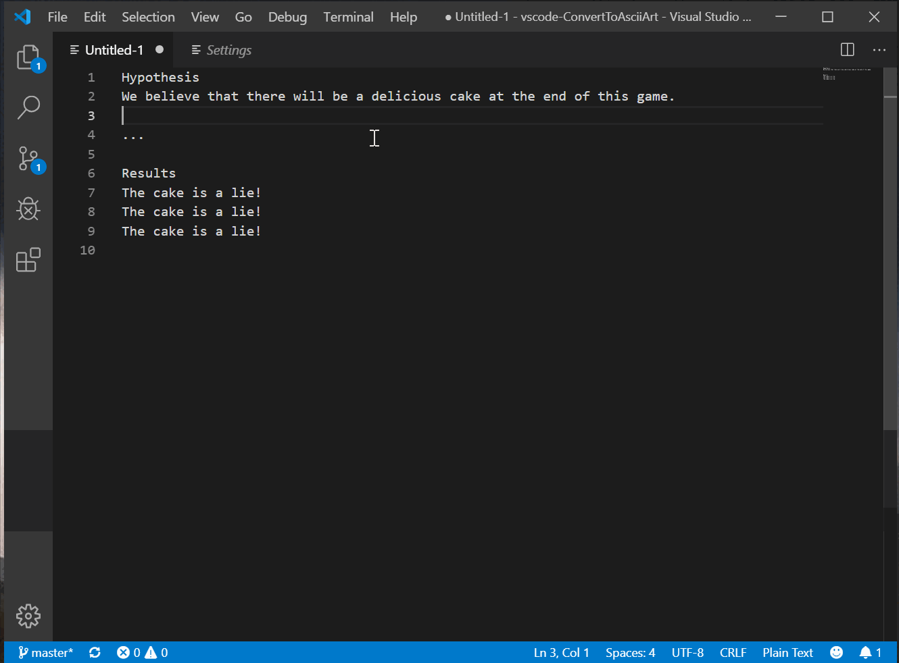
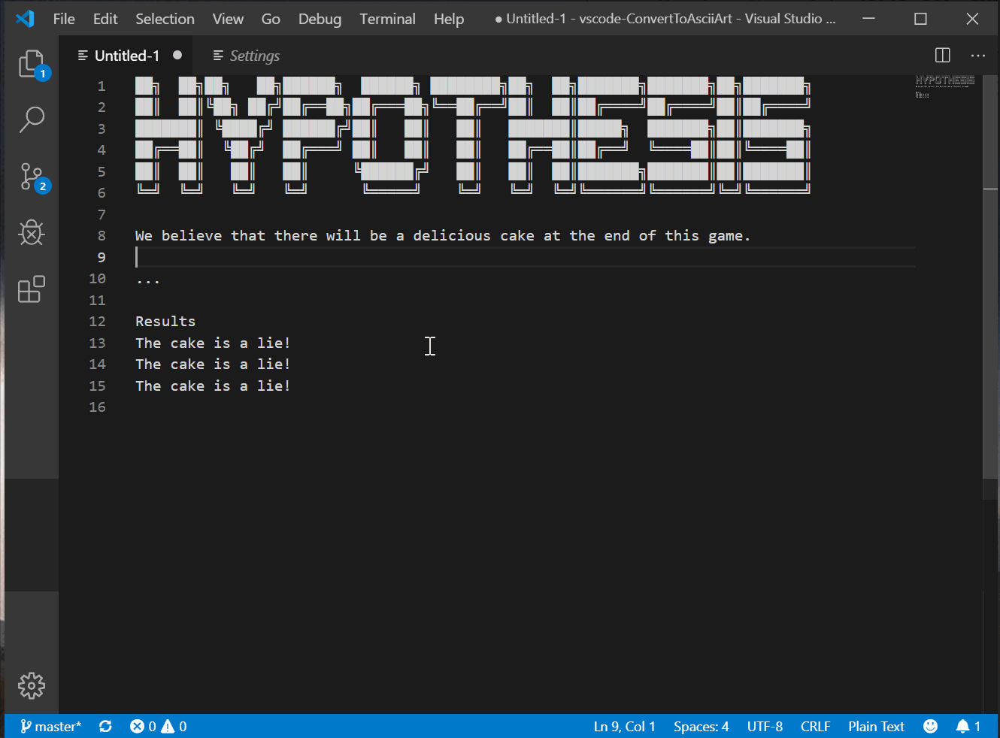

[](https://marketplace.visualstudio.com/items?itemName=BitBelt.converttoasciiart)

## Features

Converts text to ASCII art.

Go from this:
```
The cake
is a lie!
```
To this:
```
████████╗██╗  ██╗███████╗     ██████╗ █████╗ ██╗  ██╗███████╗
╚══██╔══╝██║  ██║██╔════╝    ██╔════╝██╔══██╗██║ ██╔╝██╔════╝
   ██║   ███████║█████╗      ██║     ███████║█████╔╝ █████╗  
   ██║   ██╔══██║██╔══╝      ██║     ██╔══██║██╔═██╗ ██╔══╝  
   ██║   ██║  ██║███████╗    ╚██████╗██║  ██║██║  ██╗███████╗
   ╚═╝   ╚═╝  ╚═╝╚══════╝     ╚═════╝╚═╝  ╚═╝╚═╝  ╚═╝╚══════╝
                                                             
██╗███████╗     █████╗     ██╗     ██╗███████╗██╗            
██║██╔════╝    ██╔══██╗    ██║     ██║██╔════╝██║            
██║███████╗    ███████║    ██║     ██║█████╗  ██║            
██║╚════██║    ██╔══██║    ██║     ██║██╔══╝  ╚═╝            
██║███████║    ██║  ██║    ███████╗██║███████╗██╗            
╚═╝╚══════╝    ╚═╝  ╚═╝    ╚══════╝╚═╝╚══════╝╚═╝            
```
(font: ANSI Shadow)

## Extension Activation

`Ctrl+Alt+a`: Activate extention to convert selected text.



`Ctrl+Alt+1`: Convert selected text using favorite ASCII font settings.



## Extension Settings

This extension contributes the following settings:

* `convertToAsciiArt.favoriteFont` : Favorite font (case sensitive).
* `convertToAsciiArt.favoriteHorizontalLayout` : Favorite horizontal layout setting.
* `convertToAsciiArt.favoriteVerticalLayout` : Favorite vertical layout setting.

**Enjoy!**

## Font Previews

To preview the available fonts, run `brew install figlet && showfigfonts > font-previews.txt`.

You can find the latest fonts in this repo at [font-previews.txt](./font-previews.txt).

